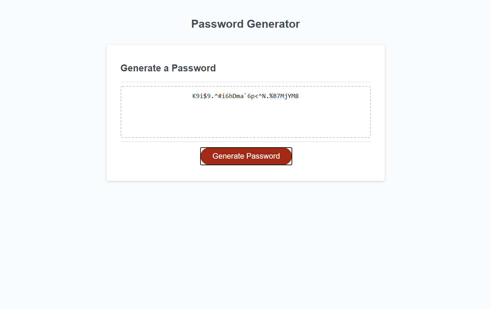

# Portfolio Revision

## Summary
An updated portfolio following a first project for school was created utilizing better coding habits and cleaner written code. All buttons on the portfolio
redirect users to specific sections of the page from the About Me, Projects, or Contact Me sections. The new html file was built using the Bulma CSS framework, utilizing multiple tiles nested inside parent elements and containers for a mobile-friendly page layout as well as desktop friendly site. The projects section was 
made to reflect the current best projects deployed on Github profile as well as an easy to navigate contact me section.
<br>
<br>

## Site Picture


<br>

## Code Snippet
```html
    <h1 class="animate__animated animate__zoomIn title" id="projects">Projects</h1>

    <div class="container is-fluid">
      <div class="tile is-ancestor">
        <div class="tile is-vertical is-4 is-parent">
          <div class="tile is-child box has-text-centered">
            <p><a href="https://github.com/michaelanthonyyy/weather-dashboard"> </a></p>
            <p class="title">Weather Dashboard</p>
            <p>A weather dashboard was created with users Traveling as a base userbase.
              Users are able to search cities with the current forecast as well as a 
              5-Day Forecast displaying as well. The dashboard allows users to search multiple
              cities while creating buttons that allow them to access weather for past searches.
            </p>
            <br>
            <a href="https://michaelanthonyyy.github.io/weather-dashboard/" style="font-weight:bold">Deployed Weather Dashboard</a>
            <br>
            <a href="https://michaelanthonyy.github.com/weather-dashboard/" style="font-weight:bold"> GitHub Repository</a>
          </div>
        </div>
        <div class="tile is-vertical is-4 is-parent">
          <div class="tile is-child box has-text-centered">
            <p><a href="https://github.com/michaelanthonyyy/project_one"> </a></p>
            <p class="title">Coding Homepage</p>
            <p>Drawing inspiration from seeing the Yahoo.Com homepage, a web portal was
              created with programmers in mind. Users are led to a programmer relevant homepage
              that displays tech news, allows users to leave themselves notes, check the weather, 
              watch youtube videos, access the most used reference pages, and place an emphasis on 
              mental health with sections dedicated to making the user happy despite the crazy world
              around them.
            </p>
            <br>
            <a href="https://michaelanthonyyy.github.io/project_one/" style="font-weight:bold"> Deployed Coding Homepage</a>
            <br>
            <a href="https://michaelanthonyy.github.com/project-one/" style="font-weight:bold"> GitHub Repository</a>
          </div>
        </div>
        <div class="tile is-vertical is-4 is-parent">
          <div class="tile is-child box has-text-centered">
            <p><a href="https://github.com/michaelanthonyyy/password-generator"> </a></p>
            <p class="title">Password Generator</p>
            <p>This web application dynamically creates a password
              based on the users choice of length and specific types
              of characters to use. The characters consist of upper-case,
              lower-case, numbers, and special characters.
            </p>
            <br>
            <a href="https://michaelanthonyyy.github.io/password-generator/" style="font-weight:bold"> Deployed Password-Generator</a>
            <br>
            <a href="https://michaelanthonyy.github.com/password-generator/" style="font-weight:bold"> GitHub Repository</a>
          </div>
        </div>
      </div>
    </div>
  
```
This code snippet is the Projects section. Each project screenshot is appended to the page as a hyperlink to their respective GitHub repository.
Using Bulma tiles with padding-left and padding-right in the CSS.Style sheet, the tiles are centered on the page. For a sense of consistency the 
projects with the smaller screenshots are laid out on the outside tiles with the Coding Homepage screenshot being the largest and most substantial
being placed in the middle tile.
<br>
<br>

## Built With

* [HTML](https://developer.mozilla.org/en-US/docs/Web/HTML)
* [CSS](https://developer.mozilla.org/en-US/docs/Web/CSS)
* [Bulma](https://bulma.io/)

<br>
<br>

## Deployed Link

[Live Link "Responsive Portfolio"](https://michaelanthonyyy.github.io/portfolio2021/)

<br>

## Authors

**Michael Medina** 
- [Link to Github](https://github.com/michaelanthonyyy)
- [Link to LinkedIn](https://www.linkedin.com/in/michael-medina-22aa70200?lipi=urn%3Ali%3Apage%3Ad_flagship3_profile_view_base_contact_details%3B311BosSLTMS4JkhAfkX61A%3D%3D)
- [Link to Portfolio](https://michaelanthonyyy.github.io/portfolio2021/)

<br>
<br>

## LICENSES

Copyright (c) 2021 MIT LICENSE